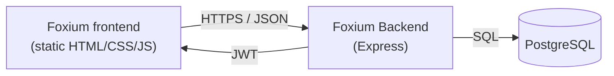
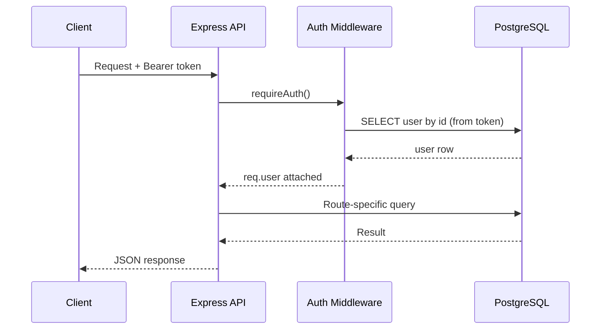

[README.md](https://github.com/user-attachments/files/32899553/README.md)
<div align="center">

# 🦊 Foxium Backend

**REST API powering the Foxium learning platform** — authentication, courses,
homework, gamified points, leaderboards and admin tools.

[](LICENSE)
[](package.json)
[](https://expressjs.com/)
[](https://www.postgresql.org/)
[](.github/workflows/ci.yml)

</div>

---

## Contents

- [Overview](#overview)
- [Architecture](#architecture)
- [Tech stack](#tech-stack)
- [Project structure](#project-structure)
- [Getting started](#getting-started)
- [Environment variables](#environment-variables)
- [API reference](#api-reference)
- [Deployment](#deployment)
- [Demo accounts](#demo-accounts)
- [Roadmap](#roadmap)
- [Contributing](#contributing)
- [License](#license)

---

## Overview

Foxium Backend is a small, dependency-light Express API backed by PostgreSQL.
It implements every endpoint the [Foxium frontend](https://github.com/)
expects out of the box: accounts with roles (student / teacher / admin),
courses, homework assignment & grading, a points/leaderboard system, a
rewards catalog, and an admin dashboard.

- 🔐 **JWT auth** with bcrypt-hashed passwords
- 🎓 **Role-based access control** (student / teacher / admin)
- 📚 **Courses & homework** lifecycle, including grading that credits points atomically
- 🏆 **Gamification** — points, levels, leaderboard, rewards
- 🛠 **Admin tools** — platform stats, user/course/homework management
- 🧩 Zero build step — plain CommonJS, deploys anywhere Node runs

## Architecture



Request flow for a typical authenticated call:



## Tech stack

| Layer          | Choice                                   |
| -------------- | ----------------------------------------- |
| Runtime        | Node.js ≥ 18                              |
| Framework      | Express 4                                 |
| Database       | PostgreSQL (tested with Supabase)         |
| Auth           | JSON Web Tokens + bcrypt                  |
| CI             | GitHub Actions (syntax check on every PR) |

## Project structure

```
foxium-backend/
├── src/
│   ├── app.js              # Express app assembly (middleware + routes)
│   ├── server.js           # Entry point
│   ├── config/
│   │   └── db.js           # PostgreSQL connection pool
│   ├── middleware/
│   │   └── auth.js         # JWT verification + role guards
│   ├── routes/
│   │   ├── auth.js         # register / login / me / profile
│   │   ├── users.js        # users, points, leaderboard
│   │   ├── courses.js      # course CRUD
│   │   ├── homework.js     # assignments, submission, grading
│   │   ├── games.js        # score logging
│   │   ├── rewards.js      # rewards catalog + claiming
│   │   └── admin.js        # stats + management endpoints
│   └── utils/
│       └── helpers.js      # level calc, JSON shaping, async wrapper
├── scripts/
│   └── seed.js             # creates demo accounts
├── schema.sql               # database schema (run once)
├── .env.example
└── .github/workflows/ci.yml
```

## Getting started

```bash
git clone https://github.com/<your-username>/foxium-backend.git
cd foxium-backend
npm install
cp .env.example .env     # fill in DATABASE_URL and JWT_SECRET
```

Run `schema.sql` once against your PostgreSQL database (e.g. paste it into the
Supabase SQL Editor and click **Run**), then:

```bash
npm start          # production
npm run dev         # auto-restarts on file changes
npm run seed         # optional: creates demo student/teacher/admin accounts
```

The API is now live at `http://localhost:3000/api`. Confirm with:

```bash
curl http://localhost:3000/api/health
# {"status":"ok"}
```

## Environment variables

| Variable       | Required | Description                                                |
| -------------- | :------: | ------------------------------------------------------------ |
| `DATABASE_URL` |    ✅    | PostgreSQL connection string                                |
| `JWT_SECRET`   |    ✅    | Long random string used to sign auth tokens                 |
| `CORS_ORIGIN`  |    —     | Allowed frontend origin(s), comma-separated. Default `*`    |
| `PORT`         |    —     | Port to listen on. Default `3000`                           |

See [`.env.example`](.env.example) for a ready-to-copy template.

## API reference

All routes are prefixed with `/api`. Protected routes require
`Authorization: Bearer <token>`.

### Auth

| Method | Endpoint              | Access | Description              |
| ------ | ---------------------- | ------ | -------------------------- |
| POST   | `/auth/register`        | Public | Create an account          |
| POST   | `/auth/login`            | Public | Log in, returns a JWT       |
| GET    | `/auth/me`               | Auth   | Current user profile        |
| PUT    | `/auth/profile`          | Auth   | Update profile fields        |

### Users

| Method | Endpoint                | Access         | Description                  |
| ------ | ------------------------ | -------------- | ------------------------------ |
| GET    | `/users`                   | Auth           | List all users                 |
| GET    | `/users/list/rating`        | Auth           | Student leaderboard (top 100)   |
| GET    | `/users/:id`                | Auth           | Get a single user               |
| PUT    | `/users/:id/points`          | Teacher/Admin  | Adjust a user's points           |

### Courses

| Method | Endpoint          | Access         | Description      |
| ------ | ------------------ | -------------- | ------------------ |
| GET    | `/courses`           | Auth           | List courses        |
| POST   | `/courses`            | Teacher/Admin  | Create a course      |
| PUT    | `/courses/:id`         | Teacher/Admin  | Update a course       |
| DELETE | `/courses/:id`         | Teacher/Admin  | Delete a course        |

### Homework

| Method | Endpoint                   | Access         | Description                              |
| ------ | ---------------------------- | -------------- | ------------------------------------------- |
| GET    | `/homework`                    | Auth           | Assignments visible to the current student   |
| GET    | `/homework/all`                 | Teacher/Admin  | All assignments with student info             |
| POST   | `/homework`                      | Teacher/Admin  | Create an assignment                           |
| PUT    | `/homework/:id`                   | Auth           | Update status                                   |
| POST   | `/homework/:id/submit`              | Auth           | Student submits work                             |
| PUT    | `/homework/:id/review`               | Teacher/Admin  | Grade work; credits points when marked `done`     |

### Games & Rewards

| Method | Endpoint            | Access | Description                      |
| ------ | --------------------- | ------ | ----------------------------------- |
| GET    | `/games`                | Auth   | Per-game best score & total points    |
| POST   | `/games/:id/score`       | Auth   | Log a round, credit points              |
| GET    | `/rewards`                | Auth   | List the rewards catalog                  |
| POST   | `/rewards/claim`           | Auth   | Redeem points for a reward                  |

### Admin

| Method | Endpoint                | Access | Description             |
| ------ | -------------------------- | ------ | -------------------------- |
| GET    | `/admin/stats`                | Admin  | Platform-wide counts         |
| GET    | `/admin/users`                 | Admin  | All users                     |
| PUT    | `/admin/users/:id`               | Admin  | Edit role/points/grade          |
| DELETE | `/admin/users/:id`                | Admin  | Delete a user                     |
| DELETE | `/admin/courses/:id`                | Admin  | Delete a course                     |
| DELETE | `/admin/homework/:id`                | Admin  | Delete an assignment                   |

## Deployment

This API is stateless and deploys cleanly to any Node host (Render, Railway,
Fly.io, a VPS, …) as long as it can reach your PostgreSQL instance.

**Render (recommended, free tier available):**

1. Push this repo to GitHub.
2. Render → **New → Web Service** → connect the repo.
3. Build command: `npm install` · Start command: `npm start`.
4. Add the environment variables listed above.
5. Deploy, then optionally run `npm run seed` from the Render Shell.

## Demo accounts

Created by `npm run seed`:

| Role    | Email                | Password   |
| ------- | ---------------------- | ------------ |
| Student | `student@foxium.uz`      | `123456`      |
| Teacher | `teacher@foxium.uz`       | `123456`       |
| Admin   | `admin@foxium.uz`          | `admin123`      |

> Change or remove these before going to production.

## Roadmap

- [ ] Password reset via email
- [ ] Refresh tokens / token revocation
- [ ] Rate limiting on auth endpoints
- [ ] Automated test suite (Jest + Supertest)
- [ ] OpenAPI/Swagger spec generated from routes

## Contributing

Contributions are welcome — see [CONTRIBUTING.md](CONTRIBUTING.md) for setup
instructions and code style notes. Please open an issue before starting
large changes.

## License

Released under the [MIT License](LICENSE).
